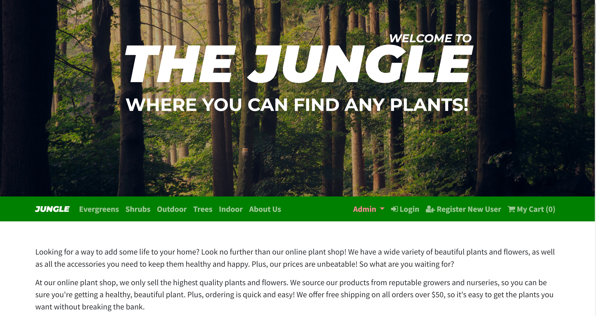
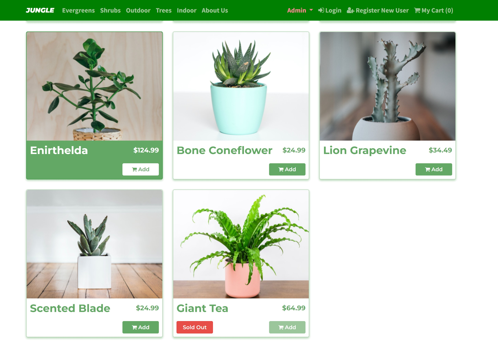
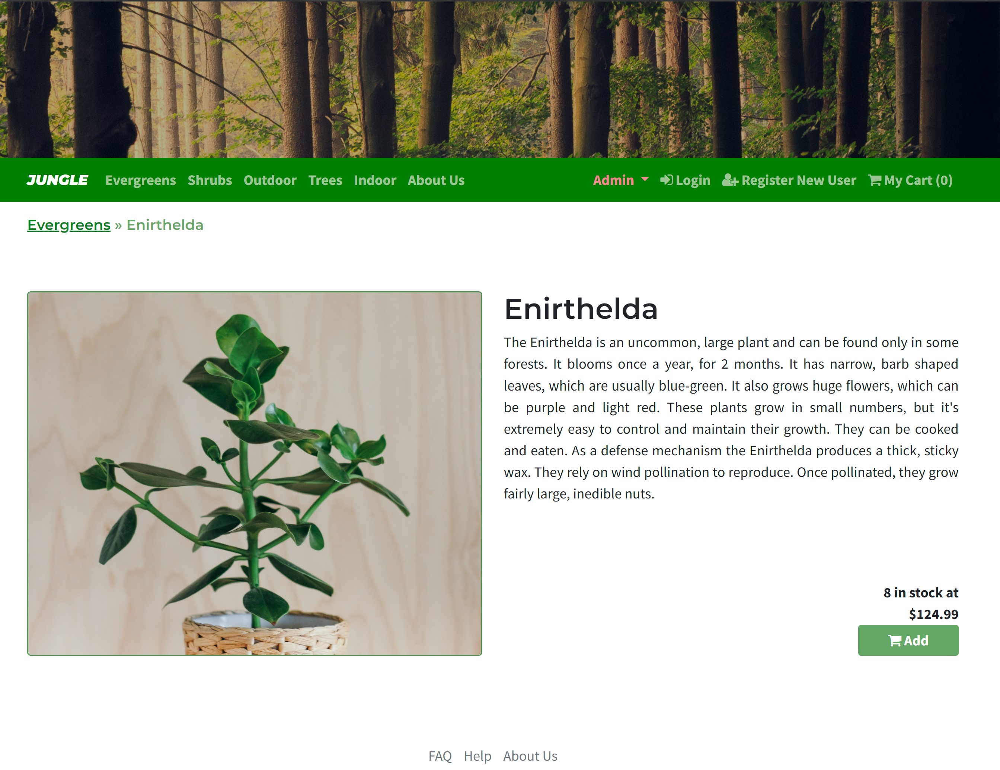
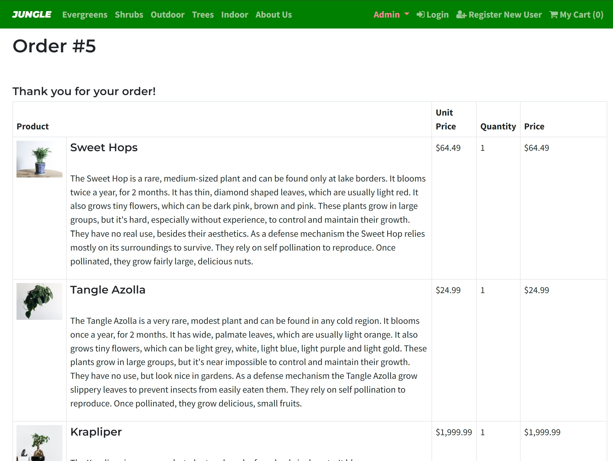
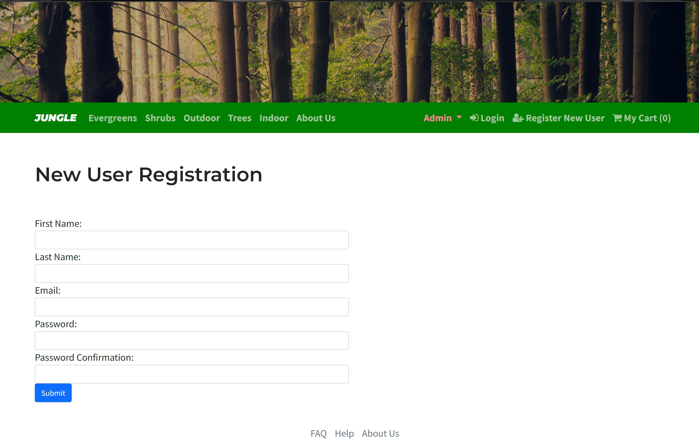
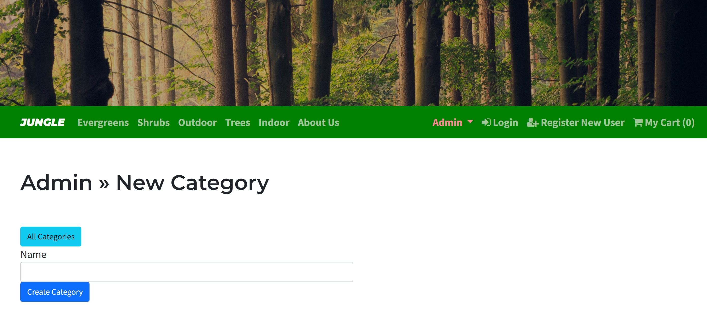
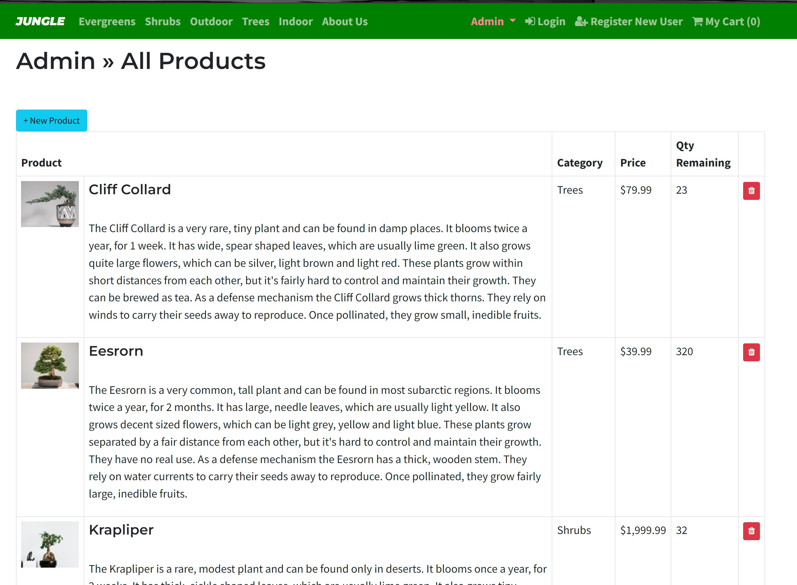
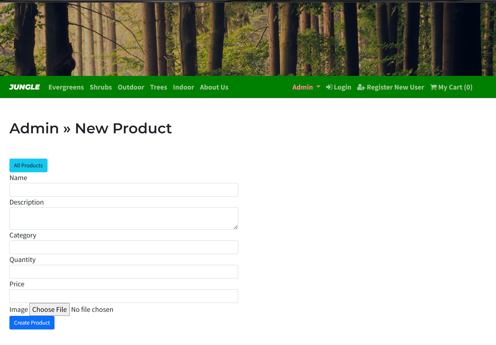

# 
# PROJECT TITLE - Jungle

## PROJECT DESCRIPTION

An ecommerce web app to buy plants by category, and user can check out using Stripe. As an admin, you will be able to see the dashboard of current status of all products and you can add or remove the products.

# TECH STACK #

## Languages, Frameworks & Database ##

## API ##

## Testing ##

## Others

# PROJECT OVERVIEW #

## Landing Page 
### Landing page to navigate through the website ###

## Products 
### Home page where you can view all available plants ###

## Prodect Details
### Prduct details page to read more about the plants or add product to cart ###

## Shopping Carts
### Shopping cart page to view added items or modify them or place order ###

## Product Checkout
### Checkout selected items using Stripe for payment ###

## Order Confirmation
### View order confirmation upon successful payment via Stripe ###

## User Registration
### Simple new user registration page ###

## Admin Dashboard
### Admin can login using admin password to view dashboard of current status of products and categories ###

## Admin Category
### Admin can view current category and add new category of plant ###

## Admin Product
### Admin can view current prducts and delete or add products  ###

## Project Setup

1. Run `bundle install` to install dependencies
2. Create `config/database.yml` by copying `config/database.example.yml`
3. Create `config/secrets.yml` by copying `config/secrets.example.yml`
4. Run `bin/rails db:reset` to create, load and seed db
5. Create .env file based on .env.example
6. Sign up for a Stripe account
7. Put Stripe (test) keys into appropriate .env vars
8. Run `bin/rails s -b 0.0.0.0` to start the server

## Database Setup

If Rails is complaining about authentication to the database, uncomment the user and password fields from `config/database.yml` in the development and test sections, and replace if necessary the user and password `development` to an existing database user.

## Stripe Testing

Use Credit Card # 4111 1111 1111 1111 for testing success scenarios.

More information in their docs: <https://stripe.com/docs/testing#cards>